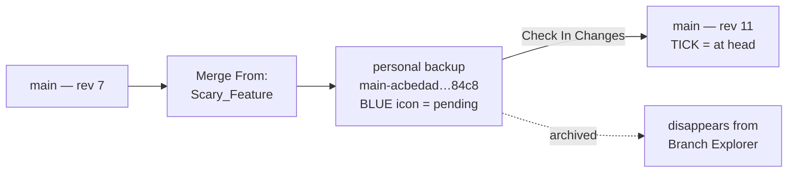

# LORE Branching & Merging — the forensics

The deep-dive behind the working rules in [06-lore-revision-control.md](06-lore-revision-control.md): the three silent merge failures and how they were diagnosed, the log archaeology, the conflict paths for text and binary, and the multi-user lock lifecycle. Read 06 for what to do; read this for why, and for the evidence.

> 🧪 **Tested 2–4 Sep 2026 on a throwaway project, deliberately.** A demo project was set up specifically to learn LORE's branch feature without risking production work. Good call — the first three merge attempts failed, and diagnosing them meant reading LORE's internal logs.
>
> **Environment:** Unreal Editor 6.0, `++Fortnite+Release-42.00`, LORE `0.8.6-nightly+331_3664`, remote `lores://urc-uefn.live.ucs.on.epicgames.com`.
>
> **Headline:** a LORE merge does **not** land on the destination branch directly. It lands on a personal backup branch and needs a second **Check In Changes** to be promoted. Miss that and the merge silently does nothing.

## The test setup

A minimal, unambiguous test — small enough that any change is obvious on inspection:

| Branch | Contents |
|---|---|
| `main` | Empty level + one white cube (`/Engine/BasicShapes/Cube`, X=840) |
| `Scary_Feature` | Same, plus a pink sphere (`/Engine/BasicShapes/Sphere`, X=828 Y=200) with a new material |

Goal: merge `Scary_Feature` into `main` and confirm the sphere and its material arrive.

## How LORE branching actually works

This is the part that isn't obvious coming from Git, and it explains nearly every surprise below.

- **"main" locally isn't `main`.** When you switch to a branch, LORE creates a **personal backup branch** named `<branch>-<32 hex>` and puts you on that. The Branch Explorer shows it nested under the real branch. The status record's `branch_name` reads `main-5920a46e…`, not `main`.
- **Merging is pull-based.** You switch to the *destination* branch and use **Merge From**. There is deliberately no "merge into" from the source branch — this is by design, not a missing feature.
- **A merge is a two-step commit.** Merge From writes the merged result onto a *fresh* personal backup branch. **Check In Changes** then promotes it onto the real branch and archives the backup.



After the check-in, `branch_name` flips from `main-<hash>` to plain `main`. That flip is the machine-readable proof the promotion happened.

## Rule earned: check in before *and* after a merge

> 🔵 **The Branch History icon is the reliable indicator. Blue = changes pending. Tick = at head.**
>
> Check in until you see the tick **before** starting a merge, and again **after** the merge completes. In the tester's words: *"even if I've checked in 0.1 seconds ago, I may need to check in again for a merge to succeed."*

The refinement worth keeping: it isn't that check-ins go stale instantly. It's that **LORE's own auto-backup can strand a commit behind your back**, and the blue icon is the only thing that surfaces it. See the failure below.

## The failure mode (three identical merges, all silently reverted)

Every attempt failed the same way and left no visible trace in the UI:

```
[Error] [lore_revision::relay] Branch has been advanced by another instance, sync and re-stage to commit
```

Each attempt ran `merge_start` → `revision::commit "[Merge From] …"` → **error** → `merge_abort`. The abort rolls everything back, which is why the level looked untouched and nothing indicated a problem.

**Root cause: the personal backup branch was split against itself.**

| Field | Value |
|---|---|
| Branch head (`revision_local`) | `f1c63569…` — **revision 5** |
| Working checkout (`revision`) | `c6119a65…` — **revision 4** |
| Remote (`revision_remote`) | `c6119a65…` — **revision 4** |
| `is_local_ahead` | **1** |

Revision 5 was an `[Automatic Backup] 1 change` commit created by the editor itself. The damning detail is the ordering: `branch::push` ran at `23:15:09.619` and that commit landed at `23:15:09.996` — **0.4 s after the push**. So it was committed and never pushed. The editor then immediately switched branches with `reset: 1`, leaving the head at revision 5 while the checkout stayed at revision 4.

Every Merge From then built its merge commit on revision 4 and tried to commit onto a branch whose head was revision 5. LORE refused. Deterministically — hence three identical failures.

**The fix** is what the error says: *sync and re-stage*. Check In Changes to flush the stranded revision, confirm the tick, then Merge From. Worked first time.

<details>
<summary>Red herrings ruled out (worth knowing, to save the time next time)</summary>

- **"Another instance" is misleading.** It was not a second client. The LORE **VS Code plugin** was running (13 `Code.exe` processes) and looked like an obvious suspect, but its log shows only reads — 669 `status`, 15 `history`, 13 `diff`, 7 `info`, 1 `subscribe` — and **zero** commits or stages. Bystander.
- **The VS Code plugin logs `No remote configured` 643 times**, so its "Branch is synchronized" readout is remote-blind and should not be trusted. Use the editor's panel.
- **The UEFN UI fires commands redundantly** — `merge_start` 2× and `commit` 3× per attempt. Noisy in the logs, but not a race: all three fail identically.
- **Method was never wrong.** Switching to `main` and using Merge From is correct.

</details>

## Why revision numbers skip

On the test project, `main`'s history showed **1, 4, 7, 11** — a skipping pattern that also shows up in real project histories and reliably prompts the question *"what happened to the missing revisions?"*. The logs account for the gaps exactly. LORE recorded these commits, **none of which appear in `main`'s history**:

```
23:15:09  [Automatic Backup] 1 change
23:22:28  [Automatic Backup] 2 changes
23:31–23:34  [Merge From] × 9   (3 failed attempts, fired 3× each)
23:44:23  [Merge From]           (the successful one)
```

They live on **personal backup branches**, so the branch-filtered history skips straight over them. The numbers aren't missing work — they're bookkeeping you're not being shown.

**Applied to an older project's history, as a hypothesis rather than a finding:** a run of missing revision numbers is most likely auto-backup and merge commits on personal branches, not lost work — which usually means there is no hidden feature in the gap and the simpler explanation stands.

**Caveat, stated plainly:** this was observed on LORE `0.8.6-nightly` in Sep 2026. Gaps in a June 2026 history were made by an older LORE. The mechanism is very likely the same, but it has not been verified against that history. The archaeology protocol — *read, never restore* — should stand until someone checks.

## Renames travel as redirectors

Renaming a material left a **1,338-byte `ObjectRedirector`** at the old path, and the sphere actor kept referencing the *old* name. It renders correctly because the redirector resolves.

**The redirector merged across to `main` intact**, along with the actor still pointing at it. Useful to know: LORE merges carry redirector cruft faithfully. Run **Fix Up Redirectors** on the folder *before* merging if you want a clean destination branch — it rewrites referencing actors and deletes the stub.

## How to read LORE's logs

No `lore` CLI exists on PATH, and `.lore/` holds no branch pointer — only `config.toml`, an identity blob, and content-addressed store indexes. Branch state is server-side. The logs are the way in:

`C:\Users\<user>\AppData\Local\UnrealEditorFortnite\Saved\Logs\Lore.log`

- **Current branch and sync state** — take the last `Repository status: LoreRepositoryStatusRevisionEventData` line. It carries `branch_name`, `revision_number`, `revision_local_number`, `revision_remote_number`, `is_local_ahead`, `remote_branch_exist`. Pipe it through `tr ',' '\n'` to read it.
- **Operation timeline** — grep `Executing command: lore::` plus the following `Command arguments:` lines.
- **The tell for this bug** — `revision_number` (checkout) lower than `revision_local_number` (head), with `is_local_ahead: 1`.
- Timestamps are **UTC**; the workstation was UTC−4.

A sibling log, `lore-vscode-plugin.log`, records the VS Code extension separately — useful for proving it *isn't* the culprit. ⚠️ Both logs rotate on engine update rather than being wiped; see the log-rotation note in [06-lore-revision-control.md](06-lore-revision-control.md) for where the backup lands.

## What was not tested (as of 3 Sep 2026)

Stated so nobody over-reads this page. *(Conflicts and multi-user were answered the following day — sections below.)*

- **No conflicting edits.** `main` never changed while the branch was open, so LORE's conflict resolution was entirely untested at this point.
- **No Verse code in the merge** — assets and actors only.
- **Single machine, single user.**
- **No branch deletion or restore-as-latest interaction.**

## Conflict handling — answered 3 Sep 2026

> ✅ **LORE neither silently merges nor refuses. It does a real three-way merge, and blocks for human review when it cannot decide.**
>
> This answers check (3) of the *Branches* entry in [06-lore-revision-control.md](06-lore-revision-control.md), and lifts the rule that branches were for abandon-or-merge-clean experiments only.

Both branches edited **the same line** of a `.verse` file from a shared ancestor. LORE materialised all three inputs beside the working file:

| Artefact | Bytes | ZONE C contained |
|---|---|---|
| `branch_test_device.verse~base` | 1747 | the common ancestor line |
| `branch_test_device.verse~mine` | 1732 | `# ZONE C: MAIN ROUND 2` |
| `branch_test_device.verse~theirs` | 1733 | `# ZONE C: SCARY ROUND 2` |

```
Branch diff found 0 changes and 1 conflicts
Final 1 conflicts
Realize 1 conflicts
Merged as text with conflict markers,
  base   Content/branch_test_device.verse~base
  mine   Content/branch_test_device.verse
  theirs Content/branch_test_device.verse~theirs
Conflicted Content/branch_test_device.verse, node flags 3129
```

**A `~base` exists, so this is a true three-way merge, not a two-way take-one-side.** That corrects an earlier hypothesis: per-file change counting had suggested whole-file semantics, and it is wrong for text.

**The flow:** a *Conflicting Changes* modal → a **Conflict Resolution** tab (`All Current` / `All Incoming` per file, plus "resolve in VS Code") → VS Code's 3-way merge editor.

### Three steps, not two — and one that can lose work

1. **Merge From** → conflict detected, merge blocked.
2. **Resolve the text** in VS Code, then **click Resolve in UEFN**. Saving in VS Code alone is *not* enough — the commit option stays unavailable until `lore::branch::merge_resolve` runs, flipping node flags `3129` (Conflicted) → `7225` (Resolved).
3. **Check In Changes** → promotes to the real branch.

> ⛔ **Resolve is a declaration, not a validation.** The log shows `merge_resolve` marking the file resolved **while the working file was still byte-identical to `~base`**. Checking in at that point would have committed the ancestor and silently discarded *both* sides' changes. **Confirm zero conflicts remaining, and that the Result pane holds what you intend, before clicking Resolve.**

ℹ️ **In VS Code's merge editor, both top panes are titled `<file>`** — LORE passes three files of the same name, so the usual Current/Incoming labelling is unreliable. **Identify panes by content.** The bottom **Result** pane is directly editable, which is the simplest way to keep both sides; mind Verse's significant indentation when hand-editing.

**Outcome:** resolved to keep *both* lines — a result neither branch had, so the resolution genuinely round-trips. The `~base` / `~mine` / `~theirs` files were **cleaned up automatically**; nothing was left loose in the content folder. `branch_name` flipped back to plain `main` at revision 25, local and remote in sync.

## Binary conflicts — answered 4 Sep 2026

> ⛔ **For binary assets there is no "keep both". It is a radio button, and the losing side's work is destroyed.**
>
> Text conflicts resolve to a result neither branch had. Binary conflicts resolve to *one branch's file*. LORE cannot merge two edits to one binary asset — only choose between them.

**Setup.** One shared-ancestor sphere actor, moved on both branches along **different axes** — two legitimate, non-overlapping edits. The feature branch also added a cone, as a deliberate non-conflicting change.

| Version | Translation | Change |
|---|---|---|
| `~base` | 828, 200, 0 | common ancestor |
| Current (`main`) | 828, **300**, 0 | moved sideways |
| Incoming (`Scary_Feature`) | 828, 200, **100** | moved up |

```
Branch diff found 4 changes and 1 conflicts
Realize 4 changes
Realized non-conflict changes
Merge identified binary file for unresolved conflict: …/J0EIWCZ6240XU4YYFF93MW.uasset
```

### What differs from the text path

- **Distinct code path** — `Merge identified binary file for unresolved conflict`, not `Merged as text with conflict markers`.
- **`~base` and `~theirs`, but NO `~mine`** — because "mine" is the live working file. That is why the current version's card reads *"Loaded in level"*.
- **The choice is its own command** — `lore::branch::merge_resolve_theirs`, distinct from the text round's plain `merge_resolve`.
- **Non-conflicting changes still come through.** 4 changes merged automatically alongside the 1 conflict; the cone arrived intact. **A conflicting file does not block the rest of the merge** — which also settles the question the text round left open.

### The UI is better than Git's, and more dangerous

UEFN shows a **genuine visual diff**: side-by-side thumbnails with size, date, revision ID and description, grouped per asset in a collapsible list so multiple conflicts can be cherry-picked, plus `All Current` / `All Incoming` bulk buttons. For a material or mesh change this is excellent.

**Three traps:**

1. **The thumbnails were identical.** A moved sphere looks like a sphere. For any transform change the visual diff tells you nothing — you are choosing blind.
2. **"Description" is the revision message, not the file's change.** The incoming card read *"added Scary Cone"* on a **sphere** conflict, because that was the branch head's message. Actively misleading; do not decide on it.
3. **"Reload level to preview" rewrites the working file** with the selected version. Not cosmetic — and since binary has no `~mine`, during resolution *your own version exists nowhere on disk*, only in LORE history. Previewing is the only way to see what you are accepting.

> 🛡️ **The "Resolve Conflicts" confirmation dialog is the only place LORE states that work will be destroyed** — *"your local conflicting changes will be overwritten by those from latest revision"*. It is suppressible via *Don't show this again*. **Do not suppress it.** For text you can inspect the merged result afterwards; for binary it is the last checkpoint before a one-way loss no diff will show you.

**Outcome:** resolved with Incoming. Sphere landed at `828, 200, 100`; `main`'s sideways move is gone from the working tree and survives only in history at revision 28. Cone intact, 6 actors in the level. `~base`/`~theirs` cleaned up automatically. `branch_name` flipped to plain `main` at revision 34.

⭐ **The rule this earns:** with One File Per Actor, two people editing **different** actors is safe — separate files, clean auto-merge. Two people editing the **same** actor means one of them loses work, every time. **Coordinate actor ownership across seats.**

*Verification note: which side won was confirmed by decoding the actor transform straight from the `.uasset` — base64 blob → skip 171 bytes past the class-name marker → read `quat(4) trans(3) scale(3)` as little-endian doubles. Read all three translation components; truncating the dump to the first two hides a Z-axis move entirely, which happened once during this test and produced a wrong conclusion.*

## Multi-user — 4 Sep 2026

Two real accounts on two machines, project moved to team space.

### Moving to team space

Repository ID, `remote_url` and instance ID were **byte-identical before and after** — no re-clone, no UEFN restart. The only observable trace was a silent notification-stream cycle:

```
04:43:19  lore::notification::unsubscribe
04:44:19  lore::notification::subscribe
04:44:19  gRPC POST /lore.notification.NotificationService/Subscribe
```

UEFN said nothing in the UI. **If you need to know whether a team transfer re-pointed your clone, diff `.lore/config.toml` and `.lore/id` — don't guess.**

### How a change arrives

**A live server push, not polling.** The second account's check-in produced a burst of `Processing notification event` records on that stream, and UEFN surfaced a nudge.

- Status flips to `is_remote_ahead: 1` with `revision_number` behind `revision_remote_number`
- The toolbar button **renames itself**: `At Latest` (greyed, passive) → **`Sync Latest`** (green, actionable). Same control, dual role — easy to miss if you're watching for a *new* button.
- **The notification is advisory only.** Nothing touches the working copy until you act; zero files changed on disk between the nudge and the sync.
- The pull is `lore::revision::sync`.
- Identity is clearly distinguished: **different username and different avatar colour** in Branch History. On one account both conflict cards read the same name with only `(You)` to tell them apart.

⚠️ **`is_remote_ahead` lags.** It still read `1` immediately after a completed sync with revisions matching at 39/39, clearing only later. **Compare `revision_number` against `revision_remote_number`; treat the boolean as a hint.**

### File locking — the most important finding

> 🔒 **LORE takes a per-file lock the moment you SAVE, not when you commit — and it is enforced, not advisory. On a shared branch this makes binary conflicts impossible by design.**

**Lifecycle**, confirmed in both directions:

1. **Acquire on save.** `lore::lock::file_acquire` fires with the exact asset path at edit time. In one case the acquire preceded its own auto-backup commit by **4 seconds**.
2. **Hold while uncommitted.** Anyone else on that branch is blocked.
3. **Release on check-in or branch switch** — in bulk, as `paths: []` meaning *release everything held on this branch*.

**Enforcement is hard.** Attempting to move a locked actor produced *"cannot edit the following assets because they are checked out by another user… changes will be automatically rolled back"*, a toast naming the holder, and an actual **`Undo: Transform`**. The edit was reverted, not merely refused.

**Locks are branch-scoped.** The same asset was locked independently under `main` and under the feature branch. **Two people on different branches do not contend at all.**

**Outliner vocabulary** — two views of the same fact from opposite ends:

| Indicator | Meaning |
|---|---|
| 🔒 red padlock | locked by **someone else** — edits refused and rolled back |
| ✅ green tick (*"item has been modified"*) | **you** modified it, so you hold the lock |
| `*` asterisk | unsaved — the ordinary UE indicator |

In the viewport a locked object **greys out when unselected** and shows its true material when selected — genuinely good at a glance across a busy level.

⚠️ **The blocking dialog names the wrong granularity.** It lists the locked file as `/<project>/TestLevel.TestLevel:PersistentLevel` — the *level* — while the Outliner correctly pins the lock to the individual actor. Read only the dialog and you would think the whole level was locked.

### Live locks, not live content

**Lock state replicates within seconds; content does not replicate at all.** The other account's rotation was invisible until an explicit check-in and sync — only the padlock appeared.

This is the opposite of Unreal's **Multi-User Editing (Concert)**, which replicated edits live. LORE is not trying to show you work in progress; it is trying to ensure you never collide with it. Different goal, and it explains the whole design.

### The trade-off, and a recommendation

Locking makes same-branch binary conflicts unreachable — which reframes the thin binary conflict UI as **the deliberate fallback for cross-branch merges**, where locks don't apply.

So the choice is between two failure modes:

| Model | Guarantee | Cost |
|---|---|---|
| **Same branch + locks** | No work is ever lost — you are blocked before a conflict can exist. Changes appear "live enough" via check-in. | You can be blocked. A lock held by someone who has gone home persists — but is recoverable, see below. |
| **Separate branches** | Never blocked, full parallel freedom. | Binary conflicts at merge time, where resolution *is* discarding someone's work. |

⭐ **The rule this earns: choose the model by file type, not by habit.** Verse files merge properly at line level, so branches are cheap and safe for code. Binary assets cannot merge at all, so a **shared branch with locks is strictly better for level and actor work**. That is close to the opposite of the usual Git instinct.

### Lock persistence and the override

**Locks are server-side and outlive everything you would expect to clear them:**

- They **survive the holder closing UEFN entirely.**
- They **survive other people's check-ins.** A check-in completed and moved the branch ahead while a teammate's lock persisted untouched.
- Release is **scoped by identity** — `LoreLockFileReleaseArgs { paths: [], owner: , owner_id: <you> }`. The bulk `paths: []` release means *everything I hold on this branch*, never anyone else's.

✅ **But there is a self-service override.** Right-click the locked asset → **Revision Control** → **`Unlock`**, or **`Unlock all (<username>)`** to force-release every lock held by that person, named explicitly in the menu.

> ⚠️ **The blocking dialog under-sells the available options.** It advises only *"coordinate with your teammate to check them back in"*, which reads as though nothing can be done locally. The context menu says otherwise. Anyone working from the dialog alone would conclude that a colleague on holiday had blocked an asset indefinitely.
>
> **Treat force-unlock as a judgment call, not a reflex** — it removes the protection around someone's *uncommitted* work, which is the one thing locking exists to guarantee.

*The `owner` field in `LoreLockFileReleaseArgs` sat empty in every release logged here, because every one was self-scoped. It is almost certainly the parameter `Unlock all (<username>)` populates — untested, but the shape fits.*

## Still open

- ❌ **Does a branch *created* on one seat appear on the other, and how promptly?** The multi-user session tested **check-in propagation on an existing branch**, never branch *creation*. Given notifications arrive as a live gRPC push, it will probably be seconds — but that is inference, not observation.
- ❌ **Does the personal-backup-branch model behave sanely with two identities?** Does each seat get its own `<branch>-<hash>` under the same parent, and can two backup branches be promoted onto one real branch without the *"advanced by another instance"* collision? **This is the one that could bite a real two-seat session**, since the local single-machine version of that collision is what cost three silent merge failures.

✅ **Related, and answered — the distinction is clean.** A *genuine* second seat announces itself as a **live notification and a `Sync Latest` prompt**; it never produces `Branch has been advanced by another instance`. **So that error means self-collision — your own stranded auto-backup — and never a real teammate.** Diagnose it as a local sync problem, not a coordination one.

## Rules earned

1. **A LORE merge isn't done until you check in again.** Blue icon = pending, tick = at head. Treat the tick as the definition of done.
2. **Check in until you see the tick before starting a merge**, because an auto-backup may have stranded a commit you never made consciously.
3. **A failed merge aborts silently.** The level looks untouched and the UI gives no error worth the name. If a merge "did nothing", read `Lore.log` — don't retry blindly. Three identical retries cost more than one log read.
4. **Skipping revision numbers are normal**, not evidence of missing work.
5. **Fix up redirectors before merging**, or the destination inherits the cruft.
6. **Learn version-control features on a throwaway project.** This one produced three failures and a log-archaeology session. On production work that would have been an evening lost to fear.

---

*Recorded 3–4 Sep 2026 from a throwaway test project. Evidence: `Lore.log`, `lore-vscode-plugin.log`, and direct inspection of `__ExternalActors__` `.uasset` files.*
